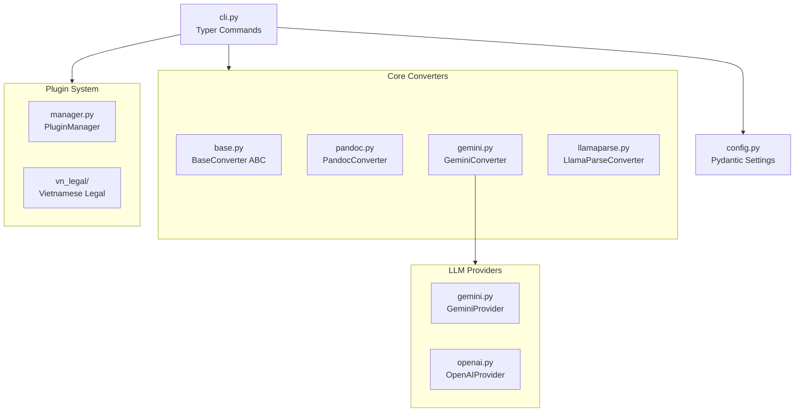

# 🧠 Brainstorming: Architecture & Performance Improvements

> **Session**: 2026-01-06  
> **Branch**: `experiment/brainstorming`  
> **Status**: Draft Ideas - Discussion Required

## 📊 Current Architecture Overview



---

## 🔍 Identified Improvement Areas

### 1. **Naming Inconsistency** ⚡ Quick Win

**Problem**: `GeminiConverter` ở `core/gemini.py` thực chất là **Universal LLM Converter**, không chỉ dùng Gemini.

**Solution**:

```diff
- class GeminiConverter(BaseConverter):
+ class LLMConverter(BaseConverter):
    """Universal Document Converter using multiple LLM backends."""
```

| Pros | Cons |
|------|------|
| Rõ ràng hơn | Breaking change cho users đang import |
| Dễ mở rộng thêm providers | Cần alias để backward compatible |

---

### 2. **Converter Registry Pattern** 🏗️ Medium

**Current**: Converters được hardcode trong CLI

```python
# cli.py line ~100
if tool == "pandoc":
    converter = PandocConverter(output_dir)
elif tool == "gemini":
    converter = GeminiConverter(output_dir)
# ...
```

**Proposed**: Registry-based auto-discovery

```python
# core/registry.py (new file)
class ConverterRegistry:
    _converters: dict[str, type[BaseConverter]] = {}
    
    @classmethod
    def register(cls, name: str):
        def decorator(converter_class):
            cls._converters[name] = converter_class
            return converter_class
        return decorator
    
    @classmethod
    def get(cls, name: str) -> type[BaseConverter]:
        return cls._converters[name]
    
    @classmethod
    def auto_select(cls, extension: str) -> BaseConverter:
        """Smart selection based on file extension and availability."""
        for name, conv_class in cls._converters.items():
            if conv_class().supports(extension):
                return conv_class()
        raise ValueError(f"No converter for {extension}")

# Usage in converter files:
@ConverterRegistry.register("pandoc")
class PandocConverter(BaseConverter):
    ...
```

| Benefit | Effort |
|---------|--------|
| Dễ thêm converter mới | 2-3 hours |
| Cleaner CLI code | Tests need update |
| Plugin converters possible | Migration path needed |

---

### 3. **Async I/O Optimization** 🚀 Performance

**Current Issue**: File I/O dùng blocking operations

```python
# pandoc.py, gemini.py, llamaparse.py
content = output_path.read_text(encoding="utf-8")  # Blocking!
output_path.write_text(final_content, encoding="utf-8")  # Blocking!
```

**Solution**: Use `aiofiles`

```python
import aiofiles

async with aiofiles.open(output_path, 'w', encoding='utf-8') as f:
    await f.write(final_content)
```

**Impact Analysis**:

- ✅ Better concurrency khi convert nhiều files
- ✅ Non-blocking event loop
- ⚠️ Thêm dependency: `aiofiles>=24.0.0`
- ⚠️ Chỉ meaningful với batch conversions lớn

---

### 4. **Provider Factory Pattern** 🏗️ Medium

**Current**: Providers được khởi tạo trong `GeminiConverter.__init__`

```python
def __init__(self, ...):
    self.gemini_provider = GeminiProvider(proxy_url=proxy_url)
    if settings.deepseek_api_key:
        self.deepseek_provider = OpenAIProvider(...)
    if settings.groq_api_key:
        self.groq_provider = OpenAIProvider(...)
```

**Proposed**: Factory with lazy initialization

```python
# providers/factory.py
class ProviderFactory:
    _instances: dict[str, LLMProvider] = {}
    
    @classmethod
    def get(cls, name: str) -> LLMProvider | None:
        if name in cls._instances:
            return cls._instances[name]
        
        provider = cls._create(name)
        if provider:
            cls._instances[name] = provider
        return provider
    
    @classmethod
    def _create(cls, name: str) -> LLMProvider | None:
        match name:
            case "gemini":
                return GeminiProvider()
            case "deepseek" if settings.deepseek_api_key:
                return OpenAIProvider(base_url=..., api_key=settings.deepseek_api_key)
            case "groq" if settings.groq_api_key:
                return OpenAIProvider(...)
            case _:
                return None
```

| Benefit | Trade-off |
|---------|-----------|
| Lazy loading = faster startup | More abstraction |
| Singleton pattern = reuse connections | Slightly more complex |
| Easy to add new providers | Need careful testing |

---

### 5. **Caching Layer** 🚀 Performance

**Idea**: Cache conversion results để tránh re-convert files không đổi

```python
# core/cache.py
import hashlib
from pathlib import Path
import json

class ConversionCache:
    def __init__(self, cache_dir: Path = Path(".mdconvert_cache")):
        self.cache_dir = cache_dir
        self.cache_dir.mkdir(exist_ok=True)
        self.index_path = cache_dir / "index.json"
    
    def get_cache_key(self, file_path: Path) -> str:
        """Generate cache key from file content hash."""
        content = file_path.read_bytes()
        return hashlib.sha256(content).hexdigest()[:16]
    
    def get(self, file_path: Path) -> str | None:
        """Get cached conversion result if exists and valid."""
        key = self.get_cache_key(file_path)
        cache_file = self.cache_dir / f"{key}.md"
        if cache_file.exists():
            return cache_file.read_text(encoding="utf-8")
        return None
    
    def set(self, file_path: Path, content: str) -> None:
        """Cache conversion result."""
        key = self.get_cache_key(file_path)
        cache_file = self.cache_dir / f"{key}.md"
        cache_file.write_text(content, encoding="utf-8")
```

**Use Cases**:

- Re-running conversion on same directory → Skip unchanged files
- CI/CD pipelines → Faster builds
- Watch mode → Only convert changed files

---

### 6. **Structured Logging** 📝 Observability

**Current**: Minimal logging, mostly `print()` via Rich console

**Proposed**: Add structured logging

```python
# core/logging.py
import logging
import json
from datetime import datetime

class ConversionLogger:
    def __init__(self):
        self.logger = logging.getLogger("mdconverter")
        
    def log_conversion(self, result: ConversionResult):
        self.logger.info(json.dumps({
            "event": "conversion_complete",
            "source": str(result.source_path),
            "status": result.status.value,
            "tool": result.tool_used,
            "duration_ms": int(result.duration_seconds * 1000),
            "quality_score": result.quality_score,
            "timestamp": datetime.now().isoformat(),
        }))
```

---

### 7. **Error Handling Strategy** 🛡️ Reliability

**Current Issue**: Exception handling inconsistent across converters

**Proposed**: Unified error hierarchy

```python
# core/exceptions.py
class MDConvertError(Exception):
    """Base exception for all mdconverter errors."""
    pass

class ConverterNotAvailableError(MDConvertError):
    """Converter tool not installed or configured."""
    pass

class ConversionTimeoutError(MDConvertError):
    """Conversion exceeded time limit."""
    pass

class InvalidInputError(MDConvertError):
    """Input file invalid or unsupported."""
    pass

class ProviderError(MDConvertError):
    """LLM Provider returned an error."""
    pass
```

---

### 8. **CLI Command Groups** 📦 UX

**Current**: Flat command structure

```
mdconvert convert ...
mdconvert validate ...
mdconvert lint ...
mdconvert config show
```

**Proposed**: More organized groups

```
mdconvert convert file.pdf        # Quick convert
mdconvert batch ./docs            # Batch convert
mdconvert watch ./docs            # Watch mode (separate command)
mdconvert providers list          # Show available providers
mdconvert providers test gemini   # Test a provider
mdconvert cache clear             # Cache management
```

---

## 📈 Priority Matrix

| Improvement | Impact | Effort | Priority |
|-------------|--------|--------|----------|
| Naming: LLMConverter | Medium | Low | ⭐⭐⭐ |
| Converter Registry | High | Medium | ⭐⭐⭐ |
| Provider Factory | Medium | Medium | ⭐⭐ |
| Async I/O | Low-Medium | Low | ⭐⭐ |
| Caching Layer | High | Medium | ⭐⭐⭐⭐ |
| Structured Logging | Medium | Low | ⭐⭐ |
| Error Hierarchy | Medium | Low | ⭐⭐ |
| CLI Reorganization | Medium | Medium | ⭐ |

---

## 🎯 Recommended Next Steps

### Phase 1: Quick Wins (1-2 sessions)

1. [ ] Rename `GeminiConverter` → `LLMConverter` với backward compat alias
2. [ ] Implement `ConversionCache` basic version
3. [ ] Add custom exception classes

### Phase 2: Architecture (3-5 sessions)

1. [ ] Implement `ConverterRegistry`
2. [ ] Refactor `ProviderFactory`
3. [ ] Migrate CLI to use registry

### Phase 3: Polish (2-3 sessions)

1. [ ] Add structured logging
2. [ ] Async I/O với aiofiles
3. [ ] CLI command reorganization

---

## ✅ Decisions Made (2026-01-06)

| Question | Decision | Rationale |
|----------|----------|-----------|
| **1. Naming** | `LLMConverter` | Tech-accurate, với alias `GeminiConverter` để backward compat |
| **2. Caching** | Opt-in (`--cache`) | An toàn cho release đầu, có thể đổi default sau |
| **3. Breaking Changes** | OK với semver | Bump v1.0.0 → v2.0.0, thời điểm tốt để clean up |
| **4. Performance** | Balanced | Improve cả single-file và batch ở mức vừa phải |

---

## 🚀 Next Steps

Dựa trên decisions trên, recommended implementation order:

### Phase 1: Core Refactoring (v2.0.0-alpha)

- [ ] Rename `GeminiConverter` → `LLMConverter`
- [ ] Implement `ConverterRegistry` pattern
- [ ] Add custom exception hierarchy
- [ ] Bump version to 2.0.0-alpha

### Phase 2: Performance Features (v2.0.0-beta)

- [ ] Implement `ConversionCache` với `--cache` flag
- [ ] Add `ProviderFactory` với lazy init
- [ ] Migrate to `aiofiles` for async I/O

### Phase 3: Polish (v2.0.0)

- [ ] Structured logging
- [ ] CLI command reorganization
- [ ] Documentation update
- [ ] Migration guide from v1.x

---

> ✅ *Brainstorming complete. Ready to create implementation_plan.md when approved.*
